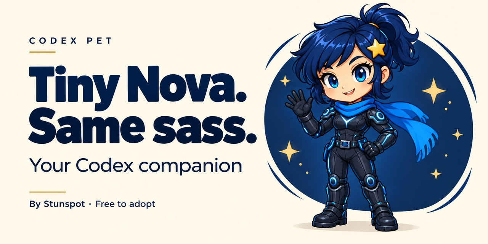

# Nova Codex Pet

**Tiny Nova. Same sass.** An animated Codex companion by Stunspot / Collaborative Dynamics.

## Get Nova

**[Install Nova from the share page](https://stunspot.github.io/codex-pet-nova/)** · **[Download the portable ZIP](https://github.com/Stunspot/codex-pet-nova/releases/download/v1.0.0/nova-codex-pet-1.0.0.zip)**

The share page has an **Install Nova** button that opens the desktop pet install flow. If your app does not support the link yet, download the ZIP and copy the **nova** folder into your Codex **pets** directory.

Windows: %USERPROFILE%\.codex\pets\nova

macOS: ~/.codex/pets/nova

With a custom CODEX_HOME, use its pets/nova directory instead. Keep a backup if a nova folder already exists. Open **Settings > Pets > Refresh** and choose **Nova**. Use /pet or Show pet to display her.

The ZIP includes a full install guide and SHA-256 checksums.

## About the pet

Navy ponytail, gold star clip, blue scarf, tech suit, blue eyes, and a well-developed facepalm. Nine animations, sixteen clockwise gaze directions, and a neutral still.

Package release **1.0.0** uses sprite format **v2**: transparent WebP, **1536 x 2288** pixels. This is the desktop Codex format. Four intermediate diagonal cues are subtle.

The exact sprite passed the bundled v2 validator and independent visual review. The portable ZIP was verified against the installed pet. The link follows the [official specification](https://learn.chatgpt.com/docs/reference/commands); a fresh-account install has not been independently tested.

## Sharing and credit

Nova the Optimal AI character and concept by **Stunspot / Collaborative Dynamics**. Pet adaptation created with Nova and OpenAI image generation. You are welcome to share this pet package with other Codex users.

[Official pet guide](https://learn.chatgpt.com/docs/pets)

Sprite SHA-256: 1b0a7c410e736b9679a00f8782c60701819c423c62cd5a878ab47b10532d0a37
